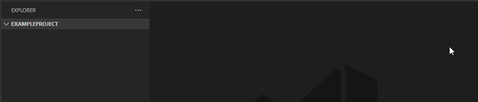

# VSCode Extension: C++ Project Generator README

[Repositry](https://github.com/LilithTheDeveloper/vscode-cpp-project-generator) | [VSCode Marketplace](https://marketplace.visualstudio.com/items?itemName=liliththedev.cpp-project-generator)

Overworked C++ project generator. Generates C++ projects including a (possibly) working .vscode enviroment. [stackoverflow said so](https://stackoverflow.com/a/50658089).

## Features

Generate C++ Projects, nuff said

 
## Requirements

### C++ Compiler (duh)
  - MingW
  - Clang
  - G++

## Recommanded Extensions

get it, it does good stuff
  - [C/C++ Expansion Extension Pack](https://marketplace.visualstudio.com/items?itemName=ms-vscode.cpptools-extension-pack)

## Extension Settings

None what so ever

## Known Issues

Yes

## Release Notes

### 1.0.0
Initial Release
